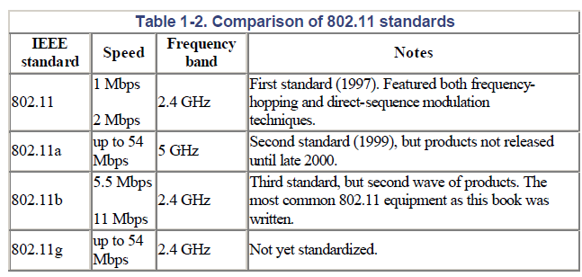
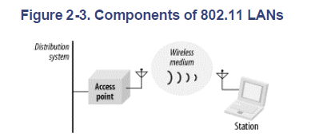
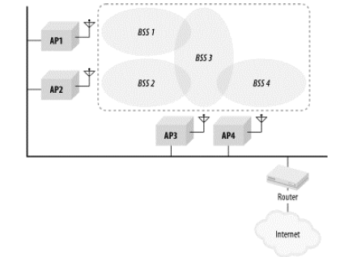
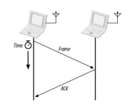

自分用にWi-Fiの仕様をまとめていく。適宜更新予定。

&nbsp; <b>INDEX</b> 

1. [Introduction](#introduction) 
1. [Architecture](#architecture) 
1. [Protocol Stack](#protocol-stack) 
    1. [MAC](#mac) 
    1. [PHY](#phy) 
        1. [変調方式](#変調方式) 
        1. [アンテナ技術](#アンテナ技術) 
        1. [通信品質](#通信品質) 
        1. [セキュリティ](#セキュリティ) 
    1. [IEE 802.11xx](#ieee-80211xx) 
1. [Regulation](#regulation) 

## Introduction
* Wi-Fiは
* 帯域幅が広いほど、通信速度は速くなる。
* 無線はマルチパス干渉やゴーストの影響を受ける。
* セキュリティが最大の懸念となる。

* IEEE 802.11はMACとPHYが含まれる、IEEE 802.11acなどはPHYのプロトコル。
* PHYはFHSS, DSSS, HR/DSSS, OFDM

* 周波数帯の利用は、各国で規制されている。米国はFCC、欧州はCEPT、日本はMIC（総務省）が規制している、周波数の重複を防ぐために、バンド帯ごとに用途が定められている。
  

### 基本用語
* **AP** 無線と有線のブリッジ機能をもち、無線ネットワークの中央ノードになるデバイス。アクセスポイント。
* **STA** APと接続して、無線ネットワークへ参加するデバイス。ステーション。

* **BSS** １つのAPと複数のSTAによって構成される無線ネットワークの単位。
    * SSID: ユーザが定義するBSSのID。STAはSSIDで参加するBSSを選択する。
    * インフラストラクチャ：一つのAPへ複数のstationが接続する。STAはSSIDで識別されるBSSへ参加する。
    * アドホック: 
* **ESS** 複数のBSSがバックボーンネットワークを通して連結されたネットワーク。ESS内のStation同士はAPとバックボーンネットワークを介して通信を行う。ESS内の複数のPAは外部からは一つのMACアドレスとして、まとめて扱える。ただし、バックボーンネットワークはAPを選択する手段がないので

* **Distribution System** AP同士をつなぐ通信システムで、STAからのフレームを適切なAPへ送る。あくまで、STA同士はつながっていない。APは地震と接続しているSTAの情報を、他のAPと共有している。Wireless Bridgeともいう。

* **APの送信方式**
    * Unicast: 特定のSTAのみへ送信
    * Mullticast: 複数のSTAへ送信
    * Broadcast: ネットワーク内のすべてのSTAへ送信
  

---
## Architecture

* **network stack**
MAtter, MQTT, LwM2Mなどのアプリケーション指向ネットワークプロトコル。
TCP/IPスタックはWi-Fi, Ethernet, ThreadなどのIPベースの通信プロトコル

* **Wi-Fi Host stack**
    * Wi-Fi ドライバ: network stack, Wi-Fi basebandおよびサプリカントとのI/F
    * サプリカント: WPA認証やネットワークスキャンなどの機能

* **Wi-Fi baseband** IEEE 802.11で定義されるPHY層とMAC層。 
    * MAC層: チャネルアクセス(CSMA/CA方式), パケット，パケットレベルのセキュリティ(WPA2/3)
    * PHY層: 信号の変調・復調, 誤り訂正, チャネル帯域幅(20MHz~160MHz), MIMOなど
        * PHYレート: 上位層のオーバーヘッドを無視した実現可能な最大データスループット 1アンテナ20MHzなら86Mbpsとなる。
        * マルチユーザ: WI-Fi6までは１対１で１つの固有のデータの通信だったが、Wi-Fi 6からMIMOとOFDMAにより、複数のユーザーに固有のデータを送信できるようになった。  
    
 （参考: [Nordic](https://docs.nordicsemi.com/bundle/ncs-3.2.0/page/nrf/protocols/wifi/wifi.html)） 

### Management operations
#### ネットワーク参加プロセス
1. **Discovery** 
    * スキャニング: エリア内に存在するネットワークを調べるプロセス。
        * パッシブスキャン: APが定期的に発信するビーコン信号から、STAがネットワークを見つける。
        * アクティブスキャン: STAが参加要求をAPへ送り、APが応答したらネットワークへ接続できる。高速で接続可能。DFSチャネルでは禁止されている。
1. **Authentification & Association**
    * Authentication: ネットワークへ接続するデバイスが名乗り出ること。
    * Association: STAがAPのBSSに登録されて、ネットワークへ参加すること。
1. **Security Proceadure**
    * Security Authentication: WPA3-SAEなどで、ユーザ認証を行う。
    * 4-way handshake
1. **Connection establised & offering IP address**
    * Provisioning: ネットワークに新たなSTAが参加するときの初期化・設定プロセス。

---
## Protocol Stack
* **プロトコル** 通信における情報のやり取りの手順を定めたルール
* **OSI基本参照モデル** ネットワーク通信を機能ごとに階層で分類したアーキテクチャ
    * データリンク層
    * 物理層
    * 通信はデータが階段を下って上るイメージ。送信側はアプリケーション層（HTTP,SMTP,MQTTなど）で送信したいデータを作成して、トランスポート層（TCP, UDP）&rarr; ネットワーク層（IPv4, v6）&rarr; データリンク層,物理層（Wi-Fi, BLE, LAN）の順に変換して、光や電気信号、無線などで物理的な信号を相手に伝送する。 それを受け取った受信側は、物理層の信号をアプリケーション層で扱えるデータ形式に変換して読み取る。 

 （引用: [Cloudflare](https://www.cloudflare.com/ja-jp/learning/ddos/glossary/open-systems-interconnection-model-osi/)） 

* **スタック** ネットワーク通信を構成する複数のプロトコルの組み合わせ。 たとえば、Wi-SUNというネットワーク通信のプロトコルスタックは以下の通りである。セッション層はECHONET、トランスポート層はUDP、ネットワーク層は6LowPan、MAC/PHYはIEEE 802.15.4である。 
 （引用: [TI](https://dev.ti.com/tirex/content/simplelink_cc13xx_cc26xx_sdk_8_32_00_07/docs/ti_wisunfan/html/wisun-stack/wisun-stack-overview.html#architecture-choices)） 
  

### MAC
* **ACK応答** ユニキャストパケット送信では、受領完了を示すACK応答を送る。受信側から送信側へACkが届かないと、送信側は送信エラーとして、再送する。

* **MAC** 無線で誰が・いつ・どうやってパケットを送信するかを決めるプロトコル
* **ALOHA方式** ノードが送信したいときに送信する方式で、衝突したら再送する。
* **CSMA/CA方式** ノードが送信前にチャネルの空きを確認してから送信する方式で、衝突回避機能をもつ。
    * **DCF** STAやAPがチャネル使用権を取り合うアルゴリズムで、CSMA/CA方式の一つ。 
    * **BSSカラーリング** 自身の通信しているAPを判別する情報（BSSカラー値）をパケットに追加する機能。BSSカラーから所属するBSSの通信状況を判断して、必要であれば衝突回避のため、別チャネルへ移動して通信を行う。Wi-Fi 6でサポート。 

* RTS/CTA方式: 送信前に送信要求信号RTSと送信可信号CTSを発信して、チャネルを占有して衝突を回避する。RTSもしくはCTSを受け取ったSTAそのチャネルを使用しなくなる。オーバーヘッドが大きく、小さいフレームでは効率が悪くなるので使われない。CSMA/CA方式ではhidden

* フラグメント: 大きなMACフレームを細かく分割して送信する機能。干渉による再送のリスクを低減する。
  

### PHY
#### 変調方式
* **変調** 信号を搬送波の振幅・周波数・位相の変化で表現すること。（参考: [村田製作所](https://article.murata.com/ja-jp/article/basics-of-digital-communication-2)）
* **FSK** 0と1を高周波と低周波の搬送波に対応させる周波数変調方式。簡単な変調方式なのでよく使われる。電力効率が高い。
* **AFK** 振幅変調
* **PSK** 位相変調。帯域利用効率が高い。
    * **QPSK** 4つの位相をシンボル11,01,00,10に対応させる。搬送波と同じ位相のI波と搬送波と直交するQ波の２種類の波を組み合わせた電波を送受信する。
* **QAM** 位相と振幅の変調。データスループットが高い。
    * 256QAM: 1シンボルで8bitを伝送する（256=2^8）
    * 1024QAM: 1シンボルで10bitを伝送する（1024=2^10）
* **OFDM** データを複数のサブキャリアに分割して並行送信する多重化技術。隣接サブキャリアの信号は位相を直交させるので干渉しにくい。ただし、１つのチャネルは1つのユーザで占有される。Wi-Fi 5以降。
* **OFDMA** 複数ユーザのデータをサブキャリアに分割して並行送信する多重化技術。 Wi-Fi 6以降。
  

#### アンテナ技術
* **SISO** 送信側と受信側がそれぞれ１つのアンテナで通信する方式
* **MIMO** 送信側と受信側が複数のアンテナで通信する方式
    * **MU-MIMO** 1つのAPと複数のSTAが複数のアンテナで同時に通信する方式
        * MU-MIMO(DL): APから複数のSTAへ同時送信する。Wi-Fi 5以降。
        * MU-MIMO(UL): 複数のSTAからAPへ同時送信する。Wi-Fi 6以降。
* Wi-Fi 6の主な特徴であるOFDMAとMU-MIMOは、どちらも信号を分割して送信する技術なので混同してしまう。OFDMAは周波数（サブキャリア）で分割して、MU-MIMOは空間（アンテナ）で分割している。
 

* **アンテナダイバーシティ** １つのRFフロントエンドに２つのアンテナを接続する技術。複数のアンテナを設置することで、仮想的に視野角を広げることができる。 ただし、２つのアンテナを同時に受信できるわけではなくて、スイッチを通してFEに接続されているアンテナだけが受信できる。 FEに接続されているANT1のRSSIがしきい値を下回ると、RFスイッチを切替えて、ANT2に接続する。 
 （引用: [TI](https://www.ti.com/lit/an/swra523b/swra523b.pdf)）

* **ビームフォーミング** APが特定のSTAに対して指向性のある電波を送信する機能。Wi-Fi 6以降。
  

#### 通信品質
* **SNR** 信号電力と雑音電力の比。γ=Ps/Pn
* **CNR** 受信された搬送波電力と雑音電力の比。SNRとは異なり、伝搬による減衰やシャドーイング、フェージングの影響を考慮している。
    * 電波の減衰は人体や金属などの障害物や伝搬損失（∝d^2）によって生じる
* **BER** 平均ビット誤り率。送信ビットの誤りが発生する割合で、熱雑音やマルチパスフェージングに影響される。フェージング環境では信号強度によらず、BERが高くなる。また、多値変調方式は多値数が増えるほどBERが高くなる。
* **コンスタレーション** 位相変調信号をIQ平面上の点で表現した図。
    * エラーベクトル
* **EVM** エラーベクトルの大きさから変調精度を評価する項目
* **PER** パケットエラーレート。無線機の送信電力に対するパケットエラーの割合をプロットした図。PERが高ければ、再送頻度が増えて通信時間は長くなる。一方、PERが低ければ、相対的に低いT送信電力で通信品質を担保できるということ。つまり、送信電力を高くしたとき、カバレッジが広くなる。（参考: [CQ出版](https://shop.cqpub.co.jp/hanbai/books/47/47231.html)）
    * PERは変調方式、イントラEMCや外部電波に影響される
    * 電子レンジを使っているときにWi-Fiが遅くなるのは、電子レンジの出すノイズ（2.45GHzのマグネトロン）でパケットエラーが生じて再送が増えているから
* **マルチパス伝搬** 電波の伝搬経路は建物や地面での反射・散乱によって多様かつ複雑になる。
    * シャドーイング: 建物や山の影に入ったときに、受信電力が弱くなる現象。電波が障害物に遮られて、届きにくいために減衰する。
    * フェージング: マルチパスの電波が干渉して強め合ったり弱め合うことで、受信電力が瞬間的に変動する現象。
  

#### セキュリティ

* 共通鍵: 送信者と受信者は同じ鍵を使う
* 公開鍵: 送信者と受信者は、ペアとなる各々の鍵をもつ
* ハッシュ: 平文をもとに、ハッシュ関数で生成される複雑かつ不可逆な文字列。 ログインサービスでは、ユーザが入力したログイン情報からハッシュを算出して、サーバーに保存されているハッシュ値と照合をおこなう。
    * SHA-256: 256bitのハッシュを生成するハッシュ関数
* AES暗号: 共有鍵方式の高速・軽量な暗号化アルゴリズム。WPA2,3で採用されている。

* **WPA3** Wi-Fi Protected Access。WLANの暗号化プロトコルはCCMP、暗号化アルゴリズムはAES、認証方式はSAE。
    * WPA3-SAE: Wi-Fi 6で標準の暗号方式。認証方式はSAEで家庭向け。
    * WPA3-Enterprise: 認証方式は証明書ベースで企業や大学向け。
  

### IEEE 802.11xx
* IEEE 802.11: IEEEが定めるPHYとMACの規格。
* **DFS** 気象レーダー（5GHz）と同じバンドを使用する際に、干渉を防ぐために、レーダーが使用中であれば、停波して別チャネルへ移動する仕組み。
* **キャリアセンス** 特定のチャネルについて、他の無線機が使用中かどうか確認する機能。チャネルがアイドル状態になるまで送信を待機する。LBS(Listen-before-Speak)。
    * Virtual Carrier-sensing: 各ノードがNAV上でチャネルの使用時間を予約しておいて、予約していない時間は送信禁止とする方式。
* **チャネルホッピング** 一定周期で通信チャネルを切り替えて、他の機器との干渉を軽減する機能。BLEは電子レンジとの干渉軽減のため、FHSSが必須。
* **チャネルボンディング** チャネル幅は20MHzだが、隣り合うチャネルを連結して、チャネル幅を広げる機能。40/80/160/320MHzまで広がり、スループットを向上できる。
* **TWT** APとSTAのスリープのタイミングをを合わせて、両者の省電力化を図る機能。
  

---
## Regulation
* 無線利用は各地域で規制されており、免許・認証が必要となる。
    * **ETSI**  ヨーロッパの無線規制機関。CEマーク。
    * **FCC**  アメリカの無線機器規制機関。
    * **IC/ISED**  カナダの無線規制機関。
    * **MIC**  日本の電波法規制機関（総務省）。技適マーク。
    * **SRRC** 中国の無線管理機関。
 

* **電波法** 無線機器に関する法律。無線局の免許制度、周波数割り当てなどの大まかなルールが決められている。
    * 電波法施行規則: 電波法の具体的な運用ルール。
    * 無線設備規則: 無線機器の技術基準（参考: [e-Gov](https://laws.e-gov.go.jp/law/325M50080000018#Mp-Ch_4-Se_4_17-At_49_20)）
 

* **ISMバンド** 産業・科学・医療用途のために、国際的に割り当てられた免許不要（ライセンスフリー）の周波数帯。 たとえば、ミリ波センサの60/77GHz帯、Wi-FiやBLE、電子レンジの2.4/5GHz帯、ZigBeeやWi-SUNの920MHz帯がある。 ただし、無制限に電波を利用できるわけではなく、各地域で定めた技術基準に適合する必要がある。
    * ARIB: 日本の電波法の技術基準（標準規格）を策定する団体。 ARIB-STDは、無線設備規則に準拠して、ISMバンド利用における周波数帯、出力制限、用途などの具体的な基準を規定している。
        * ミリ波: ARIB-STD-T48（参考: [TI](https://dev.ti.com/tirex/nodeContent?node=A__AcDXMJLpUpVPFqK8.nwajw__RADAR-ACADEMY__GwxShWe__LATEST)）
        * Wi-Fi, BLE: ARIB-STD-T66, 71 &rarr; 最大10mW
        * Sub-giga: ARIB-STD-T108 &rarr; 最大20mW
 

* **技適認証** 日本の電波法に基づき、無線機器が技術基準が適合していることを示す制度。
    * 技適取得済みの無線モジュールを組み込んだ製品は電波試験が不要かつ、モジュールの技適マークを印字できる。ただし、外部アンテナの場合は認証アンテナから選択する。
    * 証明規則: 技適認証を取得する手続きを定める。
    * 技適認証済製品の検索（参考: [総務省](https://www.tele.soumu.go.jp/giteki/SearchServlet?pageID=js01)）
    * 実験用途での特例措置（参考: [総務省](https://www.tele.soumu.go.jp/j/sys/others/exp-sp/index.htm)）海外ではこんな面倒な手続きも不要なんですが。
    * 相互認証(MRA)による工事設計認証: 海外向けの認証を自国で実施可能とする協定。たとえば、海外の認証機関で日本の技適を発行することができる。FCCを取ったから、何もせずに日本やヨーロッパで使えるわけではない。
 

* **Wi-Fi認証** Wi-Fi Alliance は、Wi-Fi製品の相互接続を保証するために、法的な無線認証とは別の業界認証制度を提供している。  
    * Wi-Fi CERTIFIEDロゴを付けるには、相互接続性、セキュリティ（WPA2/WPA3）、省電力、メッシュ（EasyMesh）、世代別機能（Wi-Fi 6/6E/7）などの試験に合格する必要がある。
  

## misc
* ATコマンド: モデムやwi-fiの通信機能を制御するための文字列コマンド
* 2.4GHzは水分子の吸収帯、60GHzは酸素分子の吸収帯であり、電波が遠くまで飛んで干渉しないように、あえてこの周波数帯が使われている。

