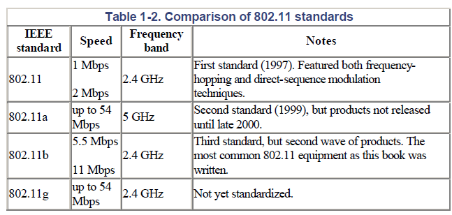
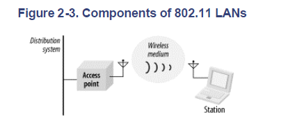
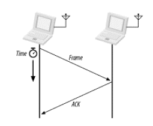

自分用にWi-SUNの仕様をまとめていく。

目次

1. [Introduction](#introduction)
1. [Architecture](##architecture)
1. [Protocol Stack](#protocol-stack)

1. [用語](##)
1. [参考文献](##Reference)

## Introduction
* Wi-Fiは
* 帯域幅が広いほど、通信速度は速くなる。
* 無線はマルチパス干渉やゴーストの影響を受ける。
* セキュリティが最大の懸念となる。

* IEEE 802.11はMACとPHYが含まれる、IEEE 802.11acなどはPHYのプロトコル。
* PHYはFHSS, DSSS, HR/DSSS, OFDM

* 周波数帯の利用は、各国で規制されている。米国はFCC、欧州はCEPT、日本はMIC（総務省）が規制している、周波数の重複を防ぐために、バンド帯ごとに用とが定められている。
* ISMバンドは免許不要のバンド帯で、エンドユーザーが免許を取得する必要は無い。
* 

* AP: 無線と有線のブリッジ機能をもつデバイス。アクセスポイント。
* STA: 無線ネットワークI/Fを備えたデバイス。ステーション。APを介してネットワークに接続する。

* BSS: ステーションとAPによって構成されるネットワークの単位。
* インフラストラクチャネットワーク：一つのAPへ複数のstationが接続する。STAはSSIDで識別されるBSSへ参加する。
* ESS: 複数のBSSがバックボーンネットワークを通して連結されたネットワーク。ESS内のStation同士はAPとバックボーンネットワークを介して通信を行う。ESS内の複数のPAは外部からは一つのMACアドレスとして、まとめて扱える。ただし、バックボーンネットワークはAPを選択する手段がないので

* Distribution System: AP同士をつなぐ通信システムで、STAからのフレームを適切なAPへ送る。あくまで、STA同士はつながっていない。APは地震と接続しているSTAの情報を、他のAPと共有している。Wireless Bridgeともいう。

## Architecture
IEEE 802.11はPHY層とMAC層のみ定義する。

* network stack
MAtter, MQTT, LwM2Mなどのアプリケーション指向ネットワークプロトコル。
TCP/IPスタックはWi-Fi, Ethernet, ThreadなどのIPベースの通信プロトコル

* Wi-Fi Host stack
    * Wi-Fi ドライバ: network stack, Wi-Fi basebandおよびサプリカントとのI/F
    * サプリカント: WPA認証やネットワークスキャンなどの機能

* Wi-Fi baseband
    * MAC層: チャネルアクセス(CSMA/CA方式), パケット，パケットレベルのセキュリティ(WPA2/3)
    * PHY層: 信号の変調・復調, 誤り訂正, チャネル帯域幅(20MHz~160MHz), MIMOなど
        * PHYレート: 上位層のオーバーヘッドを無視した実現可能な最大データスループット 1アンテナ20MHzなら86Mbpsとなる。
        * MU: WI-Fi6までは１対１で１つの固有のデータの通信だったが、Wi-Fi 6からMIMOとOFDMAにより、複数のユーザーに固有のデータを送信できるようになった。 

### Management operations
* スキャニング: エリア内に存在するネットワークを調べるプロセス。
    * パッシブスキャン: STAは受信チャネルを切り替えながら、APが発信するビーコン情報を記録する。
    * アクティブスキャン: STAがprobe Requestを送信して、APからのProbe Responseを受け取る。高速で接続可能。DFSチャネルでは禁止されている。
    * スキャンAPI: where?
    * スキャンconfig: where?
* Authentication: ネットワークへ接続するデバイスが名乗り出ること。
* Association: STAがAPのBSSに登録されて、ネットワークへ参加すること。
* Security Authentication: WPA3-SAEなどで、ユーザ認証を行う。
    * WPA3-SAE: Wi-Fi 6で標準の暗号方式。認証方式はSAEで家庭向け。
    * WPA3-Enterprise: 認証方式は証明書ベースで企業や大学向け。

## Protocol Stack
### MAC

* ACK応答: ユニキャストパケット送信では、受領完了を示すACK応答を送る。受信側から送信側へACkが届かないと、送信側は送信エラーとして、再送する。

* CSMA/CA方式: MAC層のパケット送信方式で、衝突回避方式。
    * DCF: STAやAPがチャネル使用権を取り合うアルゴリズムで、CSMA/CA方式の一つ。

* RTS/CTA方式: 送信前に送信要求信号RTSと送信可信号CTSを発信して、チャネルを占有して衝突を回避する。RTSもしくはCTSを受け取ったSTAそのチャネルを使用しなくなる。オーバーヘッドが大きく、小さいフレームでは効率が悪くなるので使われない。CSMA/CA方式ではhidden

* BSSカラーリング： BSSフレームに対して色を設定して、APやSTAは自身の色（自身の所属するBSS）で送受信が行われているときだけ、衝突回避を行う。

* DFS: 気象レーダー（5GHz）と同じバンドを使用する際に、干渉を防ぐために、レーダーが使用中であれば、別チャネルへ移動する仕組み。

* キャリアセンス: チャネルが使用可能か確認する仕組み。チャネルがアイドル状態になるまで、送信を待機する。LBS(Listen-before-Speak)。
    * Virtual Carrier-sensing: 各ノードがNAV上でチャネルの使用時間を予約しておいて、予約していない時間は送信禁止とする方式。

* フラグメント: 大きなMACフレームを細かく分割して送信する機能。干渉による再送のリスクを低減する。

### PHY

#### OFDM

---
## Reference
* [Nordic Wi-Fi overview](https://docs.nordicsemi.com/bundle/ncs-3.2.0/page/nrf/protocols/wifi/index.html)
* 